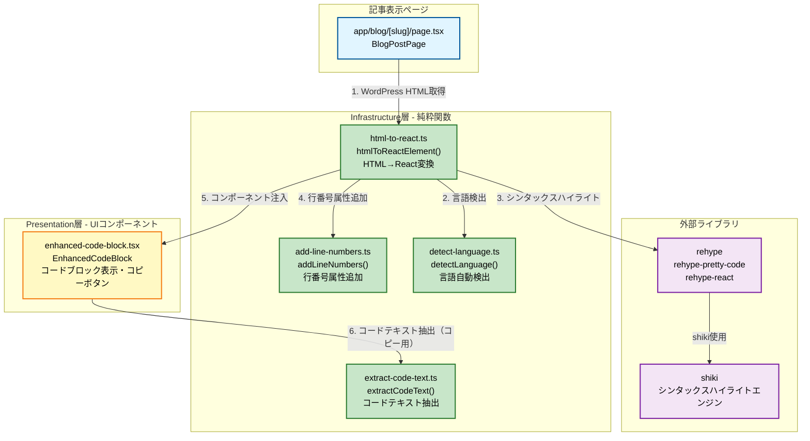
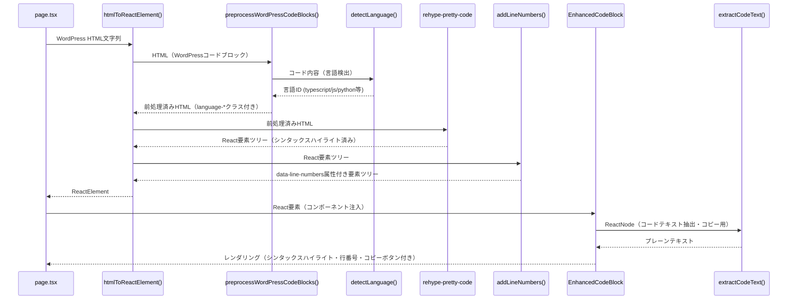
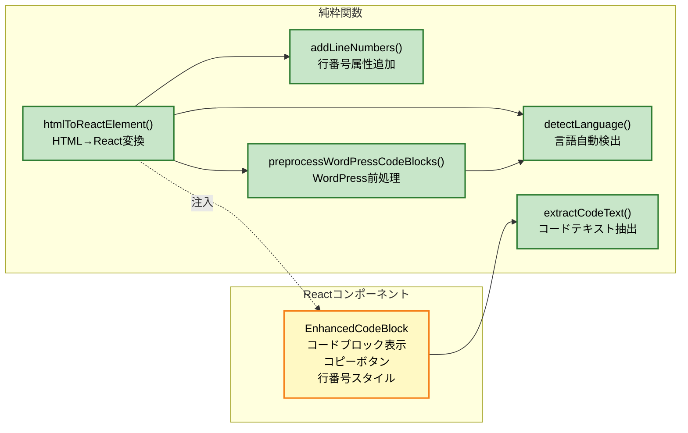
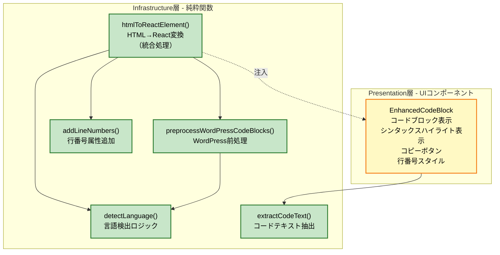

# フェーズ5.5: コードのシンタックスハイライト機能の実装

**実装日時**: 2025-10-29 21:32  
**フェーズ**: フェーズ5.5  
**実装計画書**: `docs/plans/2025-10-27_09-00_portfolio-blog/phase5.md`

---

## 1. 何を (What)

### 実装した機能
- WordPress記事コンテンツのHTML内コードブロックのシンタックスハイライト機能
- `rehype`/`rehype-pretty-code`を使用したHTML→React要素への変換
- WordPressコードブロックの言語自動検出機能
- コードコピーボタン機能
- 行番号表示機能（本実装で追加）
- VSCodeダークモダン風テーマ（dark-plus）の適用

### 変更されたファイル
- **新規作成**: `app/infrastructure/utils/html-to-react.ts` (162行) - HTML→React変換とシンタックスハイライト処理
- **新規作成**: `app/infrastructure/utils/detect-language.ts` (104行) - コード言語自動検出
- **新規作成**: `app/infrastructure/utils/extract-code-text.ts` (61行) - コードテキスト抽出（純粋関数）
- **新規作成**: `app/infrastructure/utils/add-line-numbers.ts` (117行) - 行番号属性追加（純粋関数、本実装で追加）
- **新規作成**: `app/presentation/components/blog/enhanced-code-block.tsx` (121行) - コードブロック拡張コンポーネント
- **更新**: `app/app/blog/[slug]/page.tsx` - HTML→React変換処理を統合

### 実装した主要機能

#### シンタックスハイライト機能
1. **HTML→React変換**: `htmlToReactElement`純粋関数でWordPress記事のHTMLコンテンツをReact要素に変換
   - `rehype-pretty-code`によるシンタックスハイライト適用
   - `rehype-react`によるReact要素への変換
   - 副作用を持つコンポーネントを外部から注入可能（依存関係の逆転）

2. **言語自動検出**: `detectLanguage`純粋関数でコード内容から言語を自動推定
   - TypeScript/JavaScript、Python、Bash、HTML、CSS、JSON、SQLなどを検出
   - 正規表現パターンによる判定ロジック

3. **コードコピーボタン**: `EnhancedCodeBlock`コンポーネントでコードブロック全体をクリップボードにコピー
   - ホバー時に表示されるコピーボタン
   - コピー成功時の視覚的フィードバック（チェックマーク表示）

4. **行番号表示**（本実装で追加）: `addLineNumbers`純粋関数とCSSカウンターによる行番号表示
   - React要素ツリーを走査して`code`要素に`data-line-numbers`属性を追加
   - CSSカウンターによる自動行番号生成と表示
   - 右揃え、グレーカラー、選択不可のスタイリング

---

## 2. どんな目的で (Why)

### 目的
- WordPressから取得したHTMLコンテンツに含まれるコードブロックを、プロフェッショナルなシンタックスハイライト付きで表示
- コード参照を容易にする（行番号による特定行の指定）
- デバッグやレビュー時の効率化
- VSCode風の美しいコード表示UIの提供

### 解決した課題
- WordPressのGutenbergエディタ「コード」ブロックで言語指定ができない問題（言語自動検出で解決）
- プレーンテキストとしてしか表示されないコードブロックの問題（シンタックスハイライトで解決）
- コードブロックで特定の行を参照する際の不便さ（行番号表示で解決）
- 長いコードブロックでの位置把握の難しさ（行番号表示で解決）

---

## 3. どう変更したか (How)

### 実装方法
- FDM原則に準拠した純粋関数アプローチ
- `rehype`エコシステムを使用したHTML処理
- 副作用の分離と依存関係の逆転を実現
- CSSカウンターによる行番号表示

### 技術スタック
- **rehype**: HTML処理エコシステム
- **rehype-pretty-code**: シンタックスハイライト（shikiベース）
- **rehype-react**: HTML→React要素変換
- **shiki**: ハイライトエンジン（VSCodeと同じ）
- **React**: 要素ツリーの再帰的走査と`cloneElement`
- **Tailwind CSS**: 任意値構文を使用したCSSカウンター設定

### 処理の流れ

1. **WordPress前処理** (`html-to-react.ts`内の`preprocessWordPressCodeBlocks`)
   - WordPressのコードブロック `<pre class="wp-block-code">` を検出
   - HTMLエンティティをデコード
   - `detectLanguage`純粋関数で言語を自動検出
   - `language-*`クラスを付与したコードブロックに変換

2. **シンタックスハイライト適用** (`html-to-react.ts`)
   - `rehype-pretty-code`によるシンタックスハイライト処理
   - `rehype-react`によるReact要素への変換
   - VSCode dark-plusテーマの適用

3. **行番号属性の追加**（本実装で追加）(`add-line-numbers.ts`)
   - `addLineNumbers`純粋関数でReact要素ツリーを再帰的に走査
   - `code`要素を発見した場合、`data-line-numbers`属性を追加
   - 元の要素ツリーを変更せず、新しいツリーを生成（不変性の維持）

4. **コンポーネント注入** (`page.tsx`)
   - 副作用を持つ`EnhancedCodeBlock`コンポーネントを外部から注入
   - 依存関係の逆転により純粋関数の性質を維持

5. **コードブロック表示** (`enhanced-code-block.tsx`)
   - シンタックスハイライトされたコードを表示
   - `extractCodeText`純粋関数でコードテキストを抽出（コピー機能用）
   - CSSカウンターによる行番号表示
   - コピーボタン機能

### 重要な実装ポイント

#### 純粋関数による実装
すべてのロジックを純粋関数として実装し、副作用をPresentation層のコンポーネントに分離しました。これにより、FDM原則に準拠し、テスタビリティと再利用性を確保しています。

#### 依存関係の逆転
`htmlToReactElement`純粋関数は、副作用を持つコンポーネント（`EnhancedCodeBlock`）に直接依存せず、外部から注入可能な設計になっています。これにより、純粋関数としての性質を維持しながら、UI機能を提供できます。

#### 不変性の維持
`addLineNumbers`純粋関数は、元のReact要素ツリーを変更せず、`React.cloneElement`を使用して新しいツリーを生成します。子要素が変更された場合のみ新しい要素を生成する最適化も実装しています。

#### 行番号表示の実装（本実装で追加）
CSSカウンター (`counter-reset: line`) を使用して各行の前に自動的に行番号を表示します。`data-line-numbers`属性を持つコードブロックに対してのみ行番号が表示されます。

---

## 4. 考えられる影響と範囲

### 既存機能への影響
- **影響なし**: 既存の記事表示機能に影響を与えず、シンタックスハイライト機能が追加される
- すべてのコードブロックに自動的にシンタックスハイライトと行番号が適用される
- WordPressのGutenbergエディタで言語を指定しなくても、自動的に言語が検出される

### ユーザーエクスペリエンスへの影響
- **ポジティブ**: コードが読みやすくなり、プロフェッショナルなコード表示UIとなる
- コード参照が容易になり（行番号による特定行の指定）、デバッグやレビュー時の効率が向上
- コードコピー機能により、コードを簡単に再利用できる

### パフォーマンスへの影響
- **最小限**: 純粋関数による効率的な処理
- `shiki`によるシンタックスハイライトはサーバーサイドで行われるため、クライアント側のパフォーマンスへの影響は小さい
- CSSカウンターによる行番号生成はブラウザネイティブ機能のためパフォーマンスへの影響は小さい
- `React.cloneElement`の最適化により、変更がない場合は元の要素を返すため無駄な再生成を回避

---

## 5. モジュール・コンポーネント・関数の関係性

### アーキテクチャ図



### データフロー図



### 関数依存関係図



### 責務分離図



---

## 6. 課題

### 今後の改善点
- 行番号の表示/非表示を切り替えられるオプションの追加
- 行番号のクリックで行を選択できる機能（将来的な拡張）
- 長いコードブロックでの行番号の折り返し対応
- 言語検出の精度向上（より多くの言語に対応）
- カスタムテーマの選択機能（現在はdark-plusのみ）

### パフォーマンス最適化
- 非常に長いコードブロック（1000行以上）でのパフォーマンス検証
- 仮想スクロール対応（将来的な拡張）
- シンタックスハイライト処理のキャッシュ最適化

---

## 7. コミットメッセージ

```
feat: フェーズ5.5 - コードのシンタックスハイライト機能の実装

- rehype/rehype-pretty-codeによるシンタックスハイライト機能
- WordPressコードブロックの言語自動検出機能
- コードコピーボタン機能
- 行番号表示機能（CSSカウンター）
- VSCode dark-plusテーマの適用
- FDM原則に準拠した純粋関数による実装
- 依存関係の逆転による副作用の分離
```
