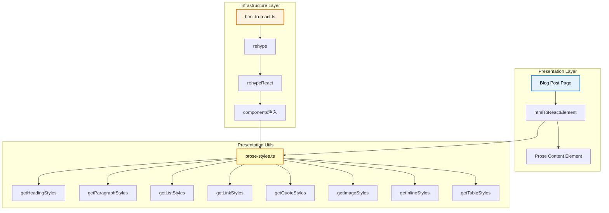
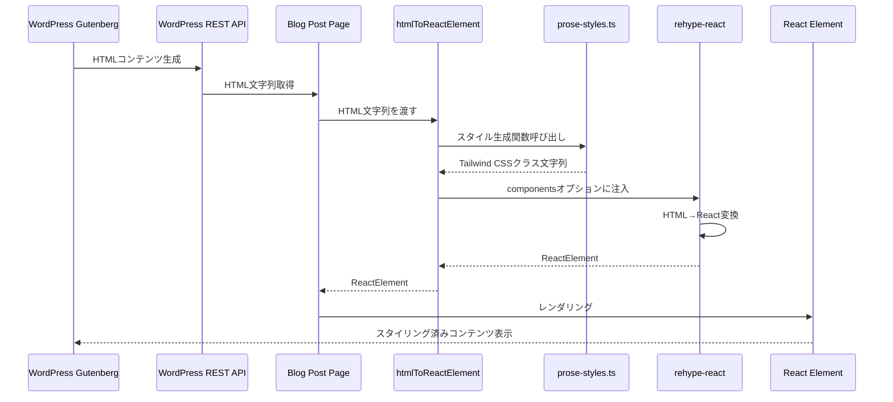
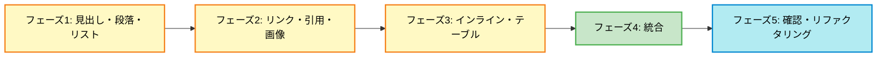

# Gutenbergエディタ装飾要素スタイリング実装計画書

## 概要
WordPress Gutenbergエディタで生成されるHTMLコンテンツに対して、
Tailwind CSSによるスタイリングを適用し、
見出しと本文に視覚的なメリハリを持たせる機能を実装する。

### 背景
現在、ブログ記事詳細ページでは`prose`クラスが適用されていたものの、
見出しと本文の区別が視覚的に分かりにくい状況にあった。
Gutenbergエディタで表現可能な主要な装飾要素に対して、
適切なスタイリングを適用することで、読みやすいブログ記事を実現する。

**実装完了**: 全フェーズ（フェーズ1〜フェーズ5）が完了し、全ての機能が実装されました。

### 目的
- ブログ記事の可読性向上
- 関数型ドメインモデリング（FDM）に準拠した実装
- 純粋関数によるスタイル生成と適用
- 工数を抑えた実装（shadcn/uiのTableコンポーネントは使用しない）

### 既存活用
- ✅ `infrastructure/utils/html-to-react.ts` - HTML変換処理（既存）
- ✅ `presentation/utils/cn.ts` - クラス名ユーティリティ（既存）
- ✅ `app/blog/[slug]/page.tsx` - ブログ記事詳細ページ（既存）

## 現在の状況

### 既に実装済み
- ✅ `prose`クラスの適用（`prose prose-slate dark:prose-invert`）
- ✅ コードブロックのシンタックスハイライト（`rehype-pretty-code`）
- ✅ HTMLをReactElementへの変換処理（`rehype-react`）
- ✅ WordPressコードブロックの言語自動検出機能

### 不足している機能
- ✅ 見出し（h1-h6）のスタイリング
- ✅ 段落（p）のスタイリング
- ✅ リスト（ul, ol, li）のスタイリング
- ✅ リンク（a）のスタイリング（外部リンク属性の自動適用も実装済み）
- ✅ 引用（blockquote）のスタイリング
- ✅ 画像（img）のスタイリング
- ✅ インライン装飾（strong, em, code）のスタイリング
- ✅ テーブル（table系）のスタイリング（Tailwind CSSで実装）

## アーキテクチャ概要

### 全体アーキテクチャ図



### モジュール依存関係図

```mermaid
graph TD
    A[blog/[slug]/page.tsx] --> B[htmlToReactElement]
    B --> C[rehypeReact]
    C --> D[components]
    D --> E[prose-styles.ts]
    
    E --> F[getHeadingStyles]
    E --> G[getParagraphStyles]
    E --> H[getListStyles]
    E --> I[getLinkStyles]
    E --> J[getQuoteStyles]
    E --> K[getImageStyles]
    E --> L[getInlineStyles]
    E --> M[getTableStyles]
    
    style A fill:#e3f2fd,stroke:#1976d2,stroke-width:2px,color:#000000
    style B fill:#fff3e0,stroke:#f57c00,stroke-width:2px,color:#000000
    style E fill:#fff9c4,stroke:#f57f17,stroke-width:2px,color:#000000
```

### データフロー図



## 実装計画

### サブフェーズ構成
- **フェーズ1.1**: スタイル生成関数（見出し・段落・リスト）の実装
- **フェーズ1.2**: スタイル生成関数（見出し・段落・リスト）のテスト
- **フェーズ2.1**: スタイル生成関数（リンク・引用・画像）の実装
- **フェーズ2.2**: スタイル生成関数（リンク・引用・画像）のテスト
- **フェーズ3.1**: スタイル生成関数（インライン装飾・テーブル）の実装
- **フェーズ3.2**: スタイル生成関数（インライン装飾・テーブル）のテスト
- **フェーズ4.1**: HTML変換処理へのスタイル適用統合
- **フェーズ4.2**: HTML変換処理のテスト更新
- **フェーズ5.1**: 全体の動作確認とリファクタリング
- **フェーズ5.2**: 最終テストとドキュメント更新

### 段階的実装ステップ図



## ファイル構成

### 新規作成ファイル

#### 実装ファイル
- `app/presentation/utils/prose-styles.ts` - スタイル生成関数集（純粋関数）
  - 見出し、段落、リスト、リンク、引用、画像、インライン装飾、テーブルのスタイル生成関数
- `app/infrastructure/utils/transform-link-attributes.ts` - 外部リンク属性変換関数（純粋関数）
  - 外部リンク判定と`target="_blank"`、`rel="noopener noreferrer"`属性の生成

#### テストファイル
- `app/presentation/utils/__tests__/prose-styles.node.spec.ts` - スタイル生成関数のユニットテスト（36件）
- `app/infrastructure/utils/__tests__/transform-link-attributes.node.spec.ts` - 外部リンク属性変換関数のユニットテスト（15件）

### 更新ファイル

#### 実装ファイル
- `app/infrastructure/utils/html-to-react.ts` - HTML変換処理にスタイル適用と外部リンク属性変換を統合
  - スタイル生成関数のインポートと適用
  - `transformLinkAttributes`のインポートと適用
  - 各HTML要素に対するカスタムコンポーネントの定義
- `app/presentation/utils/index.ts` - スタイル生成関数と型定義のエクスポート追加

#### テストファイル
- `app/infrastructure/utils/__tests__/html-to-react.node.spec.ts` - HTML変換処理のテスト更新（17件）
  - スタイル適用のテストケース追加
  - 外部リンク・内部リンクのテストケース追加

### 依存関係マトリクス

| モジュール | 依存先 | 依存関係の種類 |
|---------|--------|--------------|
| `prose-styles.ts` | なし | 独立（純粋関数） |
| `transform-link-attributes.ts` | なし | 独立（純粋関数） |
| `html-to-react.ts` | `prose-styles.ts`, `transform-link-attributes.ts`, `cn.ts` | インポート（関数呼び出し） |
| `blog/[slug]/page.tsx` | `html-to-react.ts` | インポート（関数呼び出し） |
| `index.ts` | `prose-styles.ts` | エクスポート（再エクスポート） |

## 成功指標

### 機能要件
- ✅ 見出し（h1-h6）と本文が視覚的に区別できる
- ✅ 全ての装飾要素が適切にスタイリングされている
- ✅ ダークモードでも視認性が保たれている
- ✅ レスポンシブデザインが適切に動作している
- ✅ 外部リンクの自動属性設定（`target="_blank"`, `rel="noopener noreferrer"`）

### 品質要件
- ✅ 型エラーが0件（実装関連）
- ✅ テストカバレッジが十分（68件のテストケース）
- ✅ リントエラーが0件
- ✅ 純粋関数として実装されている（副作用なし）

### パフォーマンス要件
- ✅ スタイル生成関数の実行時間が許容範囲内
- ✅ ページ読み込み時間への影響が最小限

## 実装詳細

### スタイル生成関数の設計方針

#### 純粋関数としての実装
- 副作用を持たない関数として実装
- 同じ入力に対して常に同じ出力を返す
- 外部状態に依存しない

#### Tailwind CSSクラスの生成
- Tailwind CSSのユーティリティクラスを組み合わせてスタイル文字列を生成
- レスポンシブ対応（`md:`, `lg:`プレフィックス）
- ダークモード対応（`dark:`プレフィックス）

#### 型安全性の確保
- 全ての関数に適切な型定義
- TypeScriptの型システムを活用

### 実装対象要素

#### 高優先度要素
1. **見出し（h1-h6）**: フォントサイズ、太さ、余白
2. **段落（p）**: 行間、余白、フォントサイズ
3. **リスト（ul, ol, li）**: インデント、マーカー、余白
4. **リンク（a）**: 色、ホバー、外部リンクアイコン

#### 中優先度要素
5. **引用（blockquote）**: 左ボーダー、背景色、イタリック
6. **画像（img）**: レスポンシブ、角丸、余白
7. **インライン装飾**: 太字、斜体、インラインコード

#### 低優先度要素
8. **テーブル（table系）**: ボーダー、ストライプ、ヘッダー強調

## 参考資料

### 実装計画書
- [ポートフォリオブログサイト実装計画書](../2025-10-27_09-00_portfolio-blog/index.md)
- [フェーズ5: ブログ機能実装](../2025-10-27_09-00_portfolio-blog/phase5.md)

### 技術ドキュメント
- [Tailwind CSS Typography Plugin](https://tailwindcss.com/docs/plugins#typography)
- [rehype-react Documentation](https://github.com/rehypejs/rehype-react)
- [関数型プログラミングガイド](../.cursor/rules/common/teck-stack.mdc)

