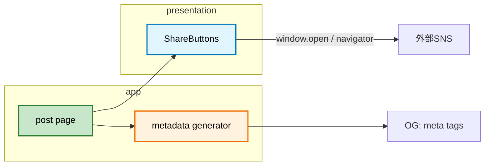
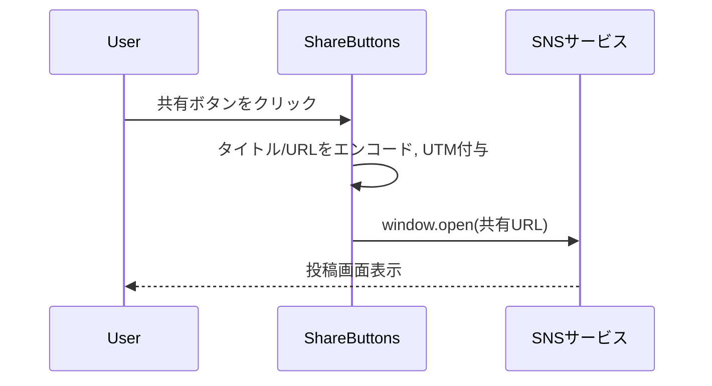
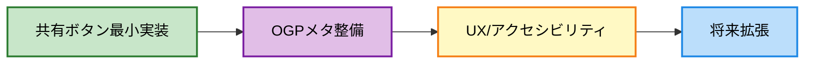

# フェーズ5.7: 共有機能（Social Sharing + OGP）実装計画書

## 概要（背景・目的・既存活用）
- 目的: ブログ記事の拡散性と紹介導線を強化し、営業/採用/技術コミュニティでの再共有を促進する。
- 対象: 記事詳細ページを中心に、共有ボタンとOGP最適化を実装。
- 既存活用: フェーズ5で完成した記事詳細/カード、ISR、タグ周りの仕組みを前提に統合。

## 現在の状況
- 実装済み: 記事詳細/一覧、タグ、シンタックスハイライト、TOC、Shared Element Transition、ISR。
- 不足:
  - 共有手段（X/Twitter, クリップボードコピー, Markdownリンク, Notion, Slack, Discord）
  - 記事単位のOGP最適化（title/description/image/Twitter Card）
  - UTMパラメータ付与（計測）
  - OGP画像自動生成（記事ごとの動的生成）

## アーキテクチャ概要
### 全体図
```mermaid
graph TD
    A[記事詳細ページ] --> B[ShareButtons コンポーネント]
    B --> C[X(Twitter) 共有URL]
    B --> D[クリップボードコピー]
    B --> E[Markdownリンクコピー]
    B --> H[Slack/Discord/Notion 用整形コピー]
    A --> F[OGP メタタグ生成]
    A --> G[UTM パラメータ付与]

    style A fill:#c8e6c9,stroke:#2e7d32,stroke-width:2px,color:#000000
    style B fill:#e1f5fe,stroke:#0277bd,stroke-width:2px,color:#000000
    style F fill:#fff3e0,stroke:#ef6c00,stroke-width:2px,color:#000000
    style G fill:#ede7f6,stroke:#5e35b1,stroke-width:2px,color:#000000
```

### モジュール依存関係


### データフロー（共有時）


## 共有方法
- クリップボード（リンクのみ、タイトル＋リンク）
- Markdown形式のリンク
- X（Twitter）
- Notion
- Slack
- Discord

## 実装計画（段階的フェーズ構成）

### フェーズ5.7.1: 共有ボタン最小実装
- X(Twitter), クリップボードコピー, Markdownリンクコピー, Notion/Slack/Discord向け整形コピーを実装
- クリック時にUTMクエリを付与（例: utm_source, utm_medium, utm_campaign）
- 成功/失敗トースト（暫定: consoleは不可。UIのトーストがあればそれを使用）

### フェーズ5.7.2: OGP画像自動生成（動的）
- 記事ごとのOGP画像を動的生成
- 対応案A: App Routerの `opengraph-image.tsx`（セグメントごと）で `ImageResponse` を返却
- 対応案B: API Route（例: `/api/og`）で生成し、メタから参照
- フォント（Noto Sans JP）組込、テーマ（dark）に準拠、タイトル/著者/日付/タグ等をレイアウト

### フェーズ5.7.3: OGPメタデータ整備
- 記事単位の `og:title`, `og:description`, `og:image`, `twitter:card` を生成
- 既存エンティティから値を生成（空の場合のフォールバック戦略定義）

### フェーズ5.7.4: UX最適化/アクセシビリティ
- ボタン群のキーボード操作/aria-label整備
- レイアウト/表示位置（記事上/下/サイド）検討と配置

### フェーズ5.7.5: 将来拡張（計画のみ・別フェーズ化可）
 - 共有完了トラッキング（UTM+イベント計測の拡充）

## 実装詳細（具体例）
- コンポーネント: `app/presentation/components/blog/share-buttons.tsx`
  - props: `{ url: string; title: string; }`
  - X共有: `https://twitter.com/intent/tweet?url={URL}&text={TITLE}`
  - クリップボード: `navigator.clipboard.writeText("{TITLE} – {SITE} {URL}")`
  - Markdownリンクコピー: `[{TITLE}]({URL})`
  - Notion/Slack/Discord: Markdown/プレーンテキストの整形コピーで対応
  - UTM: `?utm_source=twitter&utm_medium=social&utm_campaign=share_button`（媒体別に切替）

- メタデータ生成: 記事ページのメタで `og:*`/`twitter:*` を記事データから生成
  - `generateMetadata` で `openGraph`/`twitter` を構築
  - `og:image` は動的OGP画像（下記）を指す

- OGP画像自動生成（動的）:
  - ファイル: `app/app/blog/[slug]/opengraph-image.tsx`（記事ごと）
  - 仕組み: `import { ImageResponse } from 'next/og'` を用いてOGP画像をSSR生成
  - レイアウト項目: タイトル（必須）、サイト名/著者/投稿日、背景（ダーク）、フォントNoto Sans JP
  - フォールバック: 記事に必要情報がなければサイト共通 `app/app/opengraph-image.tsx` を返す

## 共有リンク生成の設計（純粋関数）
- 方針: 「共通の純粋関数コア + 共有方法ごとの薄い純粋関数」の二層構成
- 配置: `app/infrastructure/utils/share/`
- 型定義（例）:
  - `SharePayload { url: string; title: string; site?: string; hashtags?: string[]; via?: string; utm?: { source: string; medium: string; campaign: string } }`
- 共通関数（純粋）:
  - `buildShareUrl(baseUrl: string, query: Record<string,string>, utm?: UTMOptions): string`
  - `applyUtm(url: string, utm?: UTMOptions): string`
  - `encode(value: string): string`
  - `buildMarkdownLink(input: { title: string; url: string }): string`
  - `buildPlainText(input: { title: string; site?: string; url: string }): string`
- 共有方法ごとの薄い関数（純粋）:
  - `buildTwitterIntent(payload: SharePayload): string`
  - `buildClipboardText(payload: SharePayload): string`
  - `buildMarkdownForSlack(payload: SharePayload): string`（基本はMarkdownリンク＋プレーンの整形）
  - `buildMarkdownForDiscord(payload: SharePayload): string`
  - `buildMarkdownForNotion(payload: SharePayload): string`
  - これらは内部で共通関数を利用し、単一責任・重複排除・テスタビリティを担保

## ファイル構成（予定）
- `src/` 同等の本プロジェクト構成に合わせる
  - `app/presentation/components/blog/share-buttons.tsx`
  - `app/app/blog/[slug]/page.tsx`（共有ボタンの設置）
  - `app/app/blog/[slug]/metadata.ts` or ページ側の`generateMetadata`（記事OGP）
  - `app/infrastructure/utils/share/`
    - `core.ts`（共通純粋関数: URL/UTM/Markdown/PlainText）
    - `twitter.ts`（X用ビルダー）
    - `slack.ts`（Slack用整形）
    - `discord.ts`（Discord用整形）
    - `notion.ts`（Notion用整形）
    - `index.ts`（公開API集約）

## 成功指標
- 技術指標
  - 共有手段が動作（X/Markdown/コピー/Notion/Slack/Discord）
  - OGPメタが記事単位で出力
  - 記事ごとの動的OGP画像が生成・配信される（`opengraph-image.tsx`）
  - 型エラー0・Lintエラー0

- ビジネス/UX指標（参考）
  - 共有クリック率の計測基盤（将来: イベント/UTM集計）
  - 直帰率/滞在時間の改善（参考）

## 段階的実装ステップ図


## 品質チェックリスト
- [ ] 型エラー0件
- [ ] Lintエラー0件
- [ ] 共有ボタン3種が期待通りに開く/コピーできる
- [ ] OGPメタが記事単位で正しく出力
- [ ] aria-label/キーボード操作確認

## リスクと対応
- クリップボードAPIの権限: HTTPS前提。ローカルは開発サーバ起動条件を確認
- OGP画像未整備時の見栄え低下: フォールバック画像を定義
 - OGP画像生成のビルド負荷: ランタイム生成（App RouterのOGP機能）を使用し、キャッシュ/ISR方針を確認
 - フォントバンドル: Noto Sans JPの埋め込みサイズに留意しサブセット化を検討

## 付録: 共有URLテンプレ
- X(Twitter): `https://twitter.com/intent/tweet?url={url}&text={title}`
- Markdownリンク: `[${title}](${url})`
- プレーンテキスト: `${title} – ${site} ${url}`


